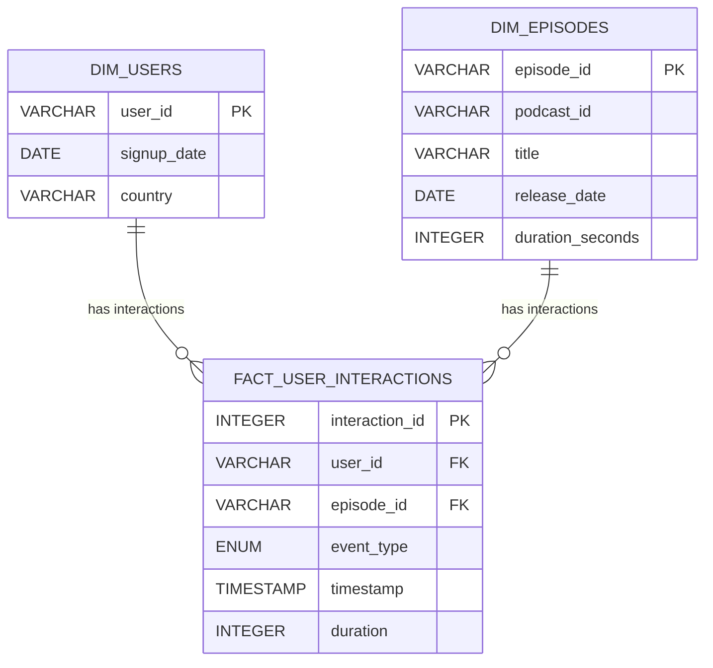

This solution design composes the [ELT](https://wikipedia.org/wiki/Extract,_load,_transform) and [Medallion Architecture](https://www.databricks.com/glossary/medallion-architecture) patterns, with DBT used for data loading, data models and data transformations. The target database for local development is DuckDB, as it supports both CSV and JSON data formats natively, and is also supported by DBT. The target database for production will be Snowflake, using my personal trial account.

## Part 1: Data Modelling

Given an ELT approach, there will be various models in DBT: 

1. A "raw" model to hold loaded data from all three sources
2. A "validated" model to hold the results of running checks based on the "data quality validation" in part 2 of the requirements
3. A "cleansed" model to hold the results of the "clean and normalise the events" in part 2 of the requirements
4. A "reference" model to hold the reference data for users and episodes (as DBT seeds)
5. An "analytics" model to support the SQL analysis questions in part 3 of the requirements.

### Bronze: Raw Model
The raw model will consist of one table for the raw event data.

#### DBT Configuration
- Materialized: incremental (to process only "new" data since last run, determined by filename column)
- Incremental strategy: db default

#### DBT Schema

- **raw_events**
  - event_type (VARCHAR)
  - user_id (VARCHAR)
  - episode_id (VARCHAR)
  - timestamp (VARCHAR)
  - duration (VARCHAR)
  - filename (VARCHAR, not nullable)
  - load_at (TIMESTAMP, not nullable)

With all columns nullable; we assume the event data may have missing values. Since the JSON schema for events is not nested, we can use the duckdb features to directly load the JSON event data into a flat table.

#### DBT Tests (Data Tests)
- Row count matches source file(s) row count

### Bronze: Validated Model
The validated model will consist of one table to hold both valid and invalid events for further investigation. The determination of valid vs invalid records will be based on the "data quality validation" requirements.

#### DBT Configuration
- Materialized: incremental (to process only "new" data since last run, determined by load_at column)
- Incremental strategy: db default

#### DBT Schema

- **raw_events_validated**
As per raw_events, plus:
  - validation_errors (VARCHAR[], not nullable) -- list of validation errors or empty list if none

#### DBT Tests (Data Tests)
- Row count matches raw_events row count
- Validation_errors is not null for all rows

### Silver: Cleansed Model
The cleansed model will consist of one table to hold the result of cleaning and normalising "new" and valid event data.

#### DBT Configuration
- Materialized: table (to process only valid data, determined by validation_errors column; not incremental since we are doing de-duplication)
- Incremental strategy: db default

#### DBT Schema
- **cleansed_events**
  - event_type (ENUM: play, pause, seek, complete)
  - user_id (VARCHAR, not null)
  - episode_id (VARCHAR, not null)
  - timestamp (TIMESTAMP, not null)
  - duration (INTEGER, nullable for non-play/complete events)

#### DBT Tests (Data Tests)
- Not null check on all columns
- Accepted values check on event_type
- Duration not negative
- Unique check on user_id, episode_id, event_type, timestamp
- Row count matches raw_events_validated row count where validation_errors is empty

### Silver: Reference Data
Two tables to hold the reference data for users and episodes. We assume it has been exported from normalised tables in an RDBMS, and therefore is already "clean" (integrity-checked and complete).

#### DBT Configuration
- Seeds: users and episodes

#### DBT Schema

- **users**
  - user_id (VARCHAR)
  - signup_date (DATE)
  - country (VARCHAR)

- **episodes**
  - episode_id (VARCHAR)
  - podcast_id (VARCHAR)
  - title (VARCHAR)
  - release_date (DATE)
  - duration_seconds (INTEGER)

With all columns not nullable and column types matching what is defined for the "analytics" model.

#### DBT Tests (Data Tests)
- Row counts match seed file(s) row count

### Gold: Analytics Model
To support the analysis questions in part 3 of the requirements, the analytics model will use a star schema:

- Allows for efficient querying and aggregation, which is ideal for analytics.
- Fact table captures all user interactions, while the dimension tables provide context for users and episodes.
- Indexes on foreign keys and frequently queried fields (e.g., event_type, timestamp) will improve query performance.

#### DBT Configuration
- Materialized: incremental (to process only "new" data since last run, determined by load_at column)
- Incremental strategy: db default

#### DBT Schema

- **fact_user_interactions**
  - interaction_id (INTEGER, PK, hash of: user_id, episode_id, event_type, timestamp); deterministic based on business key
  - user_id (FK to dim_users)
  - episode_id (FK to dim_episodes)
  - event_type (ENUM: play, pause, seek, complete)
  - timestamp (TIMESTAMP)
  - duration (INTEGER, nullable for non-play/complete events)
- **dim_users**
  - user_id (VARCHAR, PK)
  - signup_date (DATE)
  - country (VARCHAR)
- **dim_episodes**
  - episode_id (VARCHAR, PK)
  - podcast_id (VARCHAR)
  - title (VARCHAR)
  - release_date (DATE)
  - duration_seconds (INTEGER)

#### DBT Tests (Data Tests)
- Fact row count matches cleansed_events row count
- Referential integrity to users and episodes

#### ER Diagram


### Gold: Analytics Model (Analysis Questions)
To hold the sql queries for the analysis questions in part 3 of the requirements.

#### DBT Configuration
- Materialized: view

#### DBT Schema
The schema for each question is defined by the question itself.

#### DBT Tests (Data Tests)
- For the first question, all completion counts are positive

## Part 2: Data Pipeline
The pipeline for the DuckDB target would be implemented as the following steps. For each step, integration tests must be created to ensure the step works as expected.

### 1. Extract and Load

#### Description
- Full load of users and episodes data from CSV files into their own raw tables, using DBT seeds. Acceptable since these are reference data and assumed to be relatively small and stable.
- Incremental load of any "new" event data from JSON files into the raw table, using an "external" table.

Note 1. We assume that any "new" event data would typically be provided as new files, for example:
```
data/
  2024-08-01/events.json
  2024-08-02/events.json
  2024-08-03/events.json
```

Note 2. We assume that event data files may contain duplicates of data already loaded. Therefore, the "transform: cleanse and normalise" step will include a de-duplication rule to ensure that the cleansed model has no duplicates.

Note 3. We assume that event data files are in NDJSON format, with each line representing a separate JSON object. Further, we expect each JSON object to have the same schema as the raw model. Any missing fields must fail the load step completely. Any extra fields (by name, not position - we are parsing JSON!) will be ignored.

#### Integration Tests (BDD Style)

- For all events serialised to an NDJSON file and copied to the staging directory
  - When the file is copied to the loading directory and the pipeline is run with all files globbed
  - Assert the count of loaded events
  - Assert one load_at value
  - Assert one filename value

- For all events serialised to an NDJSON file and copied to the staging directory
  - When the file is copied to the loading directory and the pipeline is run with all files globbed, twice
  - Assert the count of loaded events
  - Assert one load_at value
  - Assert that load_at after the second run is the same as load_at after the first run
  - Assert one loaded filename

- For all events serialised to two separate NDJSON files and copied to the staging directory
  - When the first file is copied to the loading directory and the pipeline is run once with all files globbed, then the second file is copied to the loading directory and the pipeline run again
  - Assert the count of loaded events equals the sum of event counts
  - Assert two load_at values
  - Assert two filename values

### 2. Transform: Validation

#### Description
Validate any "new" event data in the raw model by applying checks according to the "data quality validation" requirements, updating the validated model with validated events.

More specifically, the data quality checks are:
- Columns needing not-null checks: user_id, episode_id and timestamp
- Columns needing "string not empty or blank" checks: user_id and episode_id
- Columns needing "value in set" checks: event_type must be one of play, pause, seek or complete
- Columns needing "timestamp" checks: timestamp must be a valid timestamp in ISO 8601 format with seconds precision
- Columns needing "timestamp range" checks: timestamp must be within a reasonable range (e.g. not in the future, not before 2000-01-01)
- Columns needing "time duration" checks: duration must be a positive integer for play and complete events, and null for other event types

Note 1: the data quality checks in step 2 must be compatible with the cleansing rules in step 3, i.e. any record that passes validation must be able to be cleansed without any errors.

Note 2: if any data quality checks are modified, then validation_errors must be re-calculated for all records in the raw model, not just "new" records. This can be done by running the DBT model in full-refresh mode.

#### Integration Tests (BDD Style)
- TODO

### 3. Transform: Cleanse and Normalise

#### Description
Take any "new" and valid event data from the validated model and transform it to the cleansed model according to the "clean and normalise the events" requirements.

More specifically, the cleansing and normalisation rules are:
- De-duplicate events based on user_id, episode_id, event_type and timestamp (pick the latest valid record by load_at from the duplicates)
- Convert event_type to ENUM
- Convert timestamp to TIMESTAMP type
- Convert duration to INTEGER type, setting to null for non-play/complete events
- Enforce not-null constraints on user_id, episode_id, event_type and timestamp

#### Integration Tests (BDD Style)
- TODO

### 4. Transform: Analytics

#### Description
Take any "new" event data from the cleansed model and all data from the reference model and transform it to the analytics model.

#### Integration Tests (BDD Style)
- TODO

### Data Pipeline Step Co-ordination and Scheduling
TODO

## Part 3: Analysis
The SQL queries to answer the analysis questions in part 3 of the requirements would be implemented in the analytics model with materialized: view.

## Part 4: Data Retention
This is not specified in the requirements, but a typical approach would be to implement a rolling window retention policy, e.g. keep the last 6 months of event data in the cleansed and analytics models, and archive older data to cheaper storage if needed.