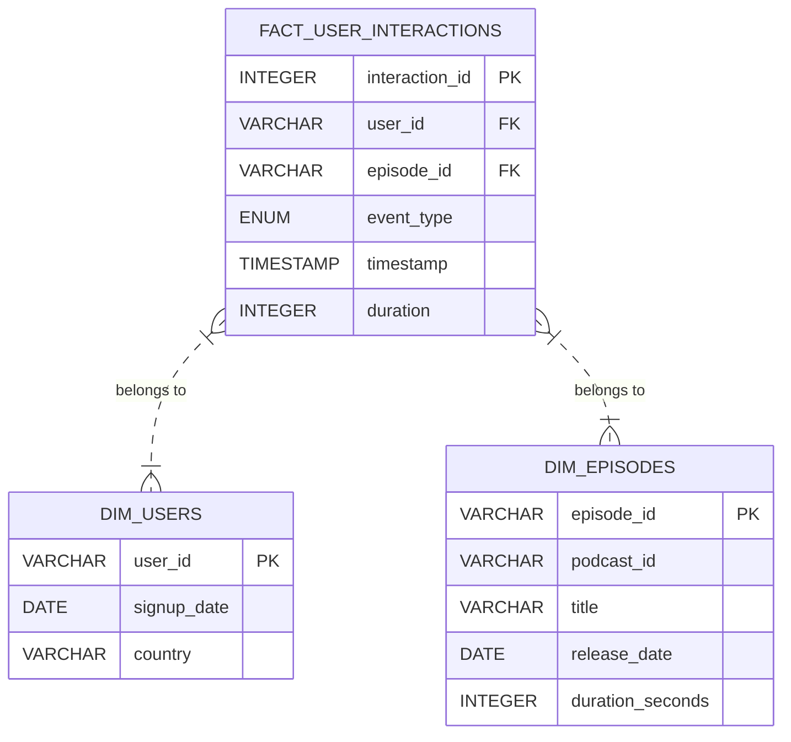

This solution design composes the ELT and Medallion Architecture patterns, with DBT used for data loading, data models and data transformations. The target database for local development is DuckDB, as it supports both CSV and JSON data formats natively, and is also supported by DBT. The target database for production will be Snowflake, using my personal trial account.

## Part 1: Data Modelling

Given an ELT approach, there will be three models in DBT: 

1. A "raw" model to hold loaded data from all three sources and also the results of running checks based on the "data quality validation" in part 2 of the requirements
3. A "cleansed" model to hold the results of the "clean and normalise the events" in part 2 of the requirements
4. An "analytics" model to support the SQL analysis questions in part 3 of the requirements.

### Raw Model (Bronze)
The raw model would consist of three tables, one for the raw event data and two for the reference data.

#### DBT Configuration
- Materialized: table (source of truth, validation errors will be updated in place)

#### Raw Event Table
To hold raw event data. Since the JSON schema is not nested, we can use the duckdb features to directly load the JSON data into a flat table.

It will hold both valid records and invalid records for further investigation. The determination of valid vs invalid records would be based on the "data quality validation" requirements.

- **raw_events**
  - event_type (VARCHAR)
  - user_id (VARCHAR)
  - episode_id (VARCHAR)
  - timestamp (VARCHAR)
  - duration (VARCHAR)
  - validation_errors (JSON) -- validation errors if any

With all columns nullable; we assume the event data may have missing values, and validation_errors is also nullable for valid records.

#### Raw Reference Tables
To hold all the user and episode reference data.

- **raw_users**
  - user_id (VARCHAR)
  - signup_date (DATE)
  - country (VARCHAR)

- **raw_episodes**
  - episode_id (VARCHAR)
  - podcast_id (VARCHAR)
  - title (VARCHAR)
  - release_date (DATE)
  - duration_seconds (INTEGER)

With all columns not nullable and column types matching what is defined for the "analytics" model; we assume reference data is exported from normalised tables in an RDBMS, and therefore is already integrity-checked and complete.

### Cleansed Model (Silver)
The cleansed model would consist of one table, to hold the result of cleaning and normalising "new" and valid event data.

#### DBT Configuration
- Materialized: table (intermediate state, incremental processing of "new" data, de-duplication)
- Incremental strategy: merge (for de-duplication)

#### Tables
- **cleansed_events**
  - event_type (ENUM: play, pause, seek, complete)
  - user_id (VARCHAR, not null)
  - episode_id (VARCHAR, not null)
  - timestamp (TIMESTAMP, not null)
  - duration (INTEGER, nullable for non-play/complete events)

### Analytics Model (Gold)
To support the analysis questions in part 3 of the requirements, the analytics model would use a star schema.

#### DBT Configuration
- Materialized: table (performance for analytics)

#### Tables
- **fact_user_interactions**
  - interaction_id (INTEGER, PK, auto-increment)
  - user_id (FK to dim_users)
  - episode_id (FK to dim_episodes)
  - event_type (ENUM: play, pause, seek, complete)
  - timestamp (TIMESTAMP)
  - duration (INTEGER, nullable for non-play/complete events)
- **dim_users**
  - user_id (VARCHAR, PK)
  - signup_date (DATE)
  - country (VARCHAR)
- **dim_episodes**
  - episode_id (VARCHAR, PK)
  - podcast_id (VARCHAR)
  - title (VARCHAR)
  - release_date (DATE)
  - duration_seconds (INTEGER)
### Justification
- The star schema allows for efficient querying and aggregation, which is ideal for analytics.
- The fact table captures all user interactions, while the dimension tables provide context for users and episodes.
- Indexes on foreign keys and frequently queried fields (e.g., event_type, timestamp) will improve query performance.
### ERD Diagram

## Part 2: Data Pipeline
The overall pipeline for the DuckDB target would be implemented as the following steps:

### 1. Extract and Load
- Full load of users and episodes data from CSV files into their own raw tables, using DBT seeds. Acceptable since these are reference data and assumed to be relatively small and stable.
- Incremental load of any "new" event JSON data into the raw table, using an external table and an incremental DBT model with timestamp-based filtering.

Note: "new" data would typically be provided as new files, for example:
```
data/
  events/
    2024-08-01/events.json
    2024-08-02/events.json
    2024-08-03/events.json
```
However, we cannot guarantee these files won't contain duplicates of data already loaded. Therefore, the "transform: cleanse and normalise" step will include a de-duplication rule to ensure that the cleansed model has no duplicates.

Note: For each of the three transformation steps that follow, DBT tests must be created to ensure the transformations work as expected.

### 2. Transform: Validation
Validate any "new" event data in the raw model by applying checks according to the "data quality validation" requirements, updating any invalid records in the model with the validation errors found.

More specifically, the data quality checks are:
- Columns needing not-null checks: user_id, episode_id and timestamp
- Columns needing "string not empty or blank" checks: user_id and episode_id
- Columns needing "timestamp" checks: timestamp must be a valid timestamp
- Columns needing "timestamp range" checks: timestamp must be within a reasonable range (e.g. not in the future, not before 2000-01-01)
- Columns needing "time duration" checks: duration must be a positive integer for play and complete events, and null for other event types

Note: the data quality checks in step 2 must be compatible with the cleansing rules in step 3, i.e. any record that passes validation must be able to be cleansed without any errors.

### 3. Transform: Cleanse and Normalise
Take any "new" and valid (i.e. null validation errors column) event data from the raw model and transform it to the cleansed model according to the "clean and normalise the events" requirements.

More specifically, the cleansing and normalisation rules are:
- De-duplicate events based on user_id, episode_id, timestamp and event_type
- Convert event_type to ENUM
- Convert timestamp to TIMESTAMP type
- Convert duration to INTEGER type, setting to null for non-play/complete events
- Enforce not-null constraints on user_id, episode_id, timestamp and event_type

### 4. Transform: Analytics
Take any "new" event data from the cleansed model and any "new" reference data from the raw model and transform it to the analytics model.

### Data Pipeline Step Co-ordination and Scheduling
TODO

## Part 3: Analysis
The SQL queries to answer the analysis questions in part 3 of the requirements would be implemented as DBT models, using the analytics model as the source.

## Part 4: Data Retention
This is not specified in the requirements, but a typical approach would be to implement a rolling window retention policy, e.g. keep the last 6 months of event data in the cleansed and analytics models, and archive older data to cheaper storage if needed.